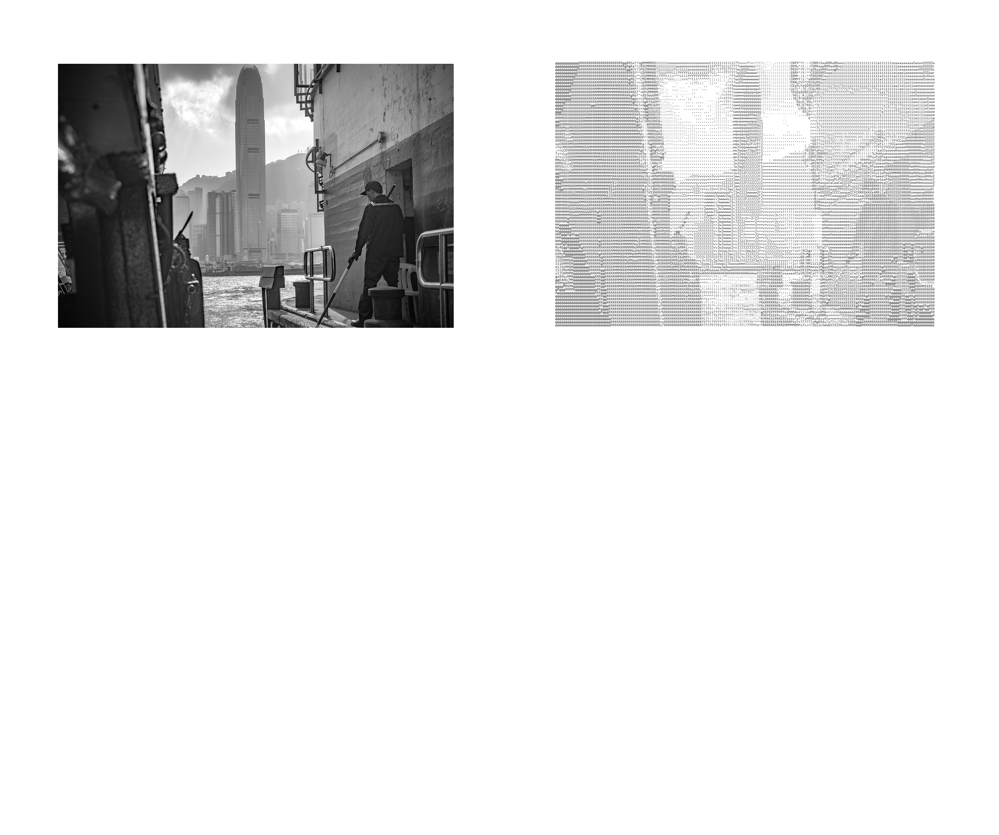
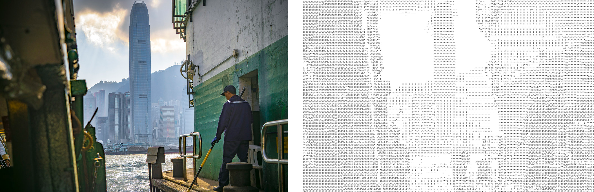
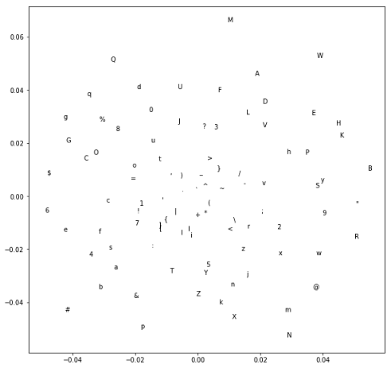

# text-as-pixel

An ASCII art generator: it makes a block of text which resembles an input image.

Unlike many other existing ASCII art generators, it takes into account the color content of the image as well. 

#### Features 
text-as-pixel allows you to choose:
* any monospace font in bitmap/TrueType/OpenType format. (For non-monospace fonts, it will use the largest monospace subset.)
* the glyphs to use for constructing the image (e.g. all of them, or a smaller subset like "MYNAMEmyname !\*.,\~")
* the balance between luminosity resolution vs. color resolution through the `lum_div` parameter.
* the output dimensions (in number of characters).
* the font size.
* the spacing between each line of text in the image.
* an interpolation method to use when re-scaling the image.

#### Drawbacks
* The glyph set is limited to ASCII 32 to 126:
 !"#$%&\'()\*+,-./0123456789:;<=>?@ABCDEFGHIJKLMNOPQRSTUVWXYZ[\\]^\_\`abcdefghijklmnopqrstuvwxyz{|}~
* The font file MUST have all of the above glyphs (TODO: check beforehand and prune to remove this constraint)
* Kerning is not taken into account: you should use monospace fonts.

## How to use it

Clone this repository. Place your fonts and images in the corresponding folders. Open the `text_as_pixel.py` file. Read the parameter options for `do_text_as_pixel` and then call it using the parameters you'd like, as in the demo at the bottom of that file.

## How it works

Here is an overview of the steps:

1. Analyze the font:
	* Prune the ASCII glyph set to create a monospace subset (if necessary).
	* Measure the character width-to-height ratio.
	* Measure each glyph's darkness, the amount of space it shades in.
	* Compute pairwise dissimilarity for each glyph via minimum Hamming distance out of all horizontal translations.
	* Create a 2D embedding of the glyphs via CMDS of the pairwise dissimilarity matrix.

2. Format the image:
	* Perform the Decolorize algorithm (see citation) to obtain a luminosity and color channel for the image. 
	* Re-scale by superimposing a grid onto the image such that each cell will become a glyph in the output. 
	* Convert each cell into a single (luminosity, color) value via the interpolation method (e.g. median).
3. Map a glyph onto each pixel:
	* Convert glyph darkness into a luminosity percentile, relative to the subset of potential glyphs.
	* Round luminosity percentiles such that there are `lum_div` unique percentile values.
	* Among all glyphs at a given luminosity percentile, order them by projecting their CMDS embeddings onto their 1D PCA subspace. Assign each glyph, in order, to an equaly-sized region of the colorspace for that luminosity percentile. For example, if the PCA ordering was ['y','q','p'], lower-third color values will be assigned 'y', and upper-third color values will be assigned 'p'. (If there is only one glyph at the luminosity percentile, it will be chosen for any color.)
	* The mapping from a pixel's (luminosity, color) to a glyph is then the following: (I) Round the luminosity to the nearest available percentile. (II) Choose the glyph for the color region it occupies. 
	* Apply this mapping to each pixel in the re-scaled image.
4. Write results to an image file or text file.

## Citation

My method of processing the color content directly uses this algorithm:

	Decolorize: Fast, Contrast Enhancing, Color to Grayscale Conversion   
	Mark Grundland and Neil A. Dodgson   
	Pattern Recognition, vol. 40, no. 11, pp. 2891-2896, (2007). ISSN 0031-3203.   
	http://www.eyemaginary.com/Portfolio/TurnColorsGray.html   
	http://www.eyemaginary.com/Rendering/decolorize.m   