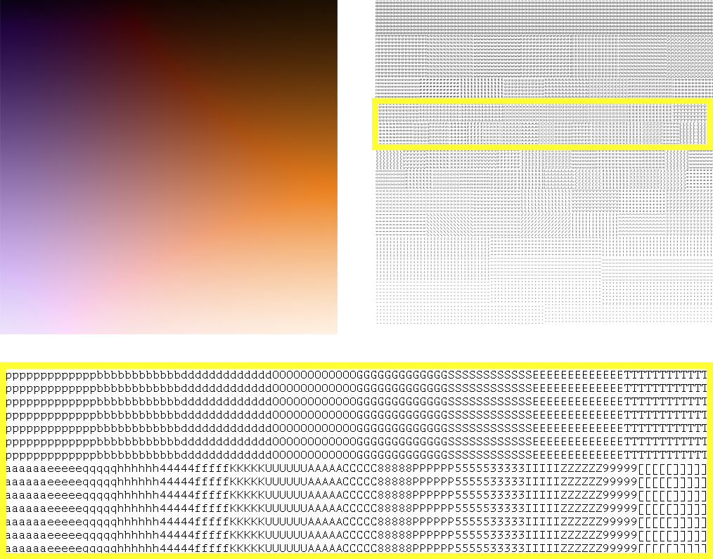

# pixel-to-glyph

An "ASCII art" generator: it makes a block of text which resembles an input image.

Unlike many other existing "ASCII art" generators, it takes into account the color content of the image as well. It also works with any monospace font, and any Unicode glyphs supported by that font.

#### Features
pixel-to-glyph allows you to choose:
* any monospace font in bitmap/TrueType/OpenType format. (For non-monospace fonts, it will use the largest monospace subset.)
* the Unicode glyphs to use for constructing the image (e.g. all ASCII characters, a smaller subset like "MYNAMEmyname !\*.,\~", or certain symbols)
* the balance between luminosity resolution vs. color resolution through the `lum_div` parameter.
* the output dimensions (in number of glyphs).
* the font size.
* the spacing between each line of text in the image.
* an interpolation method to use when re-scaling the image.

#### Drawbacks
* Kerning is not taken into account: you should use monospace fonts.
* Color transformation is stochastic and image-dependent. Video should be vectorized before input, instead of running this algorithm frame-by-frame.

## How to use it

Clone this repository. Place your fonts and images in the corresponding folders. Open the `pixel-to-glyph.py` file. Read the parameter options for `do_pixel_to_glyph()` and then call it using the parameters you'd like, as in the demo at the bottom of that file.

If you'd like to use this code but some aspect is not clear, feel free to open up a PR or contact me! Some of the documentation may be outdated & inaccurate.

## How it works

Here is an overview of the steps:

1. Analyze the font:
	* Prune the glyph set to create a monospace subset (if necessary).
	* Measure the character width-to-height ratio.
	* Measure each glyph's darkness: the amount of space it shades in.
	* Compute pairwise dissimilarity for each glyph via minimum Jaccard distance out of all horizontal translations.
	* Create a 2D embedding of the glyphs via CMDS of the pairwise dissimilarity matrix.

2. Format the image:
	* Perform the Decolorize algorithm (see citation) to obtain a luminosity and color channel for the image. (TODO: allow for Decolorize hyperparameters to be tweaked.)
	* Re-scale by superimposing a grid onto the image such that each cell will become a glyph in the output.
	* Convert each cell into a single (luminosity, color) value via the interpolation method (default: median).
3. Create the pixel-to-glyph mapping:
	* Convert glyph darkness into a luminosity percentile, relative to the glyph set.
	* Round luminosity percentiles such that there are `lum_div` unique percentile values.
	* Among all glyphs at a given luminosity percentile, order them by projecting their CMDS embeddings onto a line (default: their 1D PCA subspace). Assign each glyph, in order, to an equally-sized region of the color-space for that luminosity percentile. For example, if the PCA ordering was ['y','q','p'], lower-third color values will be assigned 'y', and upper-third color values will be assigned 'p'. (If there is only one glyph at the luminosity percentile, it will be used for any color.)
	* The mapping from a pixel's (luminosity, color) to a glyph is then the following: (I) Round the luminosity to the nearest available percentile. (II) Choose the glyph for the color region it occupies.
    * The (luminosity, color) to glyph mapping can be saved as a "spectrum" for analysis.

4. Make the output:
	* Apply the mapping to each pixel in the re-scaled image.
	* Write results to an image file or text file.

## Citation

My method of processing the color content directly uses this algorithm:

	Decolorize: Fast, Contrast Enhancing, Color to Grayscale Conversion   
	Mark Grundland and Neil A. Dodgson   
	Pattern Recognition, vol. 40, no. 11, pp. 2891-2896, (2007). ISSN 0031-3203.   
	http://www.eyemaginary.com/Portfolio/TurnColorsGray.html   
	http://www.eyemaginary.com/Rendering/decolorize.m   
